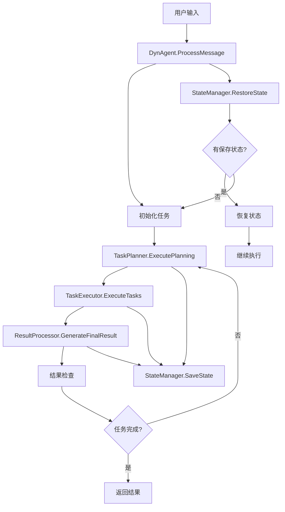

# Go Agent 架构文档

## 🏗️ 总体架构

Go Agent 采用模块化架构，将复杂的AI代理系统分解为9个核心组件，每个组件都有明确的职责边界。

```
┌─────────────────────────────────────────────────────────────┐
│                        DynAgent                             │
│                     (协调器/控制器)                          │
├─────────────────────────────────────────────────────────────┤
│  ┌─────────────┐  ┌─────────────┐  ┌─────────────┐         │
│  │ TaskPlanner │  │TaskExecutor │  │ResultProcessor│       │
│  │   (规划)    │  │   (执行)    │  │   (结果)    │         │
│  └─────────────┘  └─────────────┘  └─────────────┘         │
├─────────────────────────────────────────────────────────────┤
│  ┌─────────────┐  ┌─────────────┐  ┌─────────────┐         │
│  │MessageManager│ │StateManager │  │ ConfigManager│        │
│  │   (消息)    │  │   (状态)    │  │   (配置)    │         │
│  └─────────────┘  └─────────────┘  └─────────────┘         │
├─────────────────────────────────────────────────────────────┤
│  ┌─────────────┐  ┌─────────────┐  ┌─────────────┐         │
│  │  CallLLM    │  │   Models    │  │    Tools    │         │
│  │  (LLM调用)  │  │  (数据模型) │  │   (工具)    │         │
│  └─────────────┘  └─────────────┘  └─────────────┘         │
└─────────────────────────────────────────────────────────────┘
```

## 📦 组件详解

### 1. DynAgent (主控制器)
**位置:** `internal/agent/dynagent.go`

**职责:**
- 作为所有组件的协调器
- 管理整个任务处理生命周期
- 处理状态转换和错误恢复

**核心方法:**
```go
func (da *DynAgent) ProcessMessage(task, refMDFiles, outputFile string, parentAgentList []string) (*models.ProcessMessageResult, error)
func (da *DynAgent) SaveState() error
func (da *DynAgent) RestoreState() error
func (da *DynAgent) ResetForNewConversation()
```

**工作流程:**
1. 初始化新任务
2. 执行规划阶段
3. 执行任务阶段  
4. 生成结果阶段
5. 检查结果阶段

### 2. ConfigManager (配置管理)
**位置:** `internal/config/config.go`

**职责:**
- LLM配置管理
- 执行参数配置
- 代理配置管理
- 配置验证和持久化

**核心结构:**
```go
type ConfigManager struct {
    LLMConfig       *LLMConfig
    ExecutionConfig *ExecutionConfig
    AgentConfig     *AgentConfig
}
```

### 3. MessageManager (消息管理)
**位置:** `internal/messaging/message_manager.go`

**职责:**
- 系统消息构建
- 对话历史管理
- 消息格式化和过滤
- 上下文信息整合

**消息类型:**
- 系统角色提示
- 任务描述
- 函数调用说明
- 代理调用说明
- 参考文档

### 4. TaskPlanner (任务规划)
**位置:** `internal/planning/task_planner.go`

**职责:**
- 任务分解和规划
- 依赖关系管理
- 计划验证和优化
- 后续计划生成

**规划状态:**
- `Empty`: 需要初始规划
- `Continue`: 有未完成任务
- `Finish`: 所有任务已完成

### 5. TaskExecutor (任务执行)
**位置:** `internal/execution/task_executor.go`

**职责:**
- 子任务执行调度
- 并行/串行执行控制
- 工具函数调用
- 代理间通信

**执行模式:**
- 串行执行：依次执行任务
- 并行执行：同时执行独立任务
- 依赖执行：按依赖关系执行

### 6. StateManager (状态管理)
**位置:** `internal/state/state_manager.go`

**职责:**
- 运行状态管理
- 状态持久化和恢复
- 状态快照创建
- 备份和清理

**状态类型:**
- `Empty`: 空状态
- `Planning`: 规划中
- `RunSubTask`: 执行子任务中
- `FinalResultGen`: 生成最终结果中
- `FinalResultCheck`: 检查最终结果中
- `Finish`: 完成

### 7. ResultProcessor (结果处理)
**位置:** `internal/results/result_processor.go`

**职责:**
- 最终结果生成
- 结果摘要生成
- 结果格式化
- 结果验证

### 8. CallLLM (LLM调用)
**位置:** `internal/llm/call_llm.go`

**职责:**
- 多LLM提供商支持
- 流式和非流式调用
- 错误处理和重试
- Token使用统计

**支持的提供商:**
- OpenAI (GPT-3.5, GPT-4)
- 可扩展其他提供商

### 9. Models (数据模型)
**位置:** `internal/models/models.go`

**职责:**
- 核心数据结构定义
- JSON序列化支持
- 数据验证方法
- 工厂方法

## 🔄 数据流



## 🏛️ 设计模式

### 1. 策略模式 (Strategy Pattern)
**应用:** LLM提供商切换
```go
type LLMClient interface {
    Call(messages []models.Message, stream bool) (*LLMResponse, error)
}

type OpenAIClient struct { ... }
type AnthropicClient struct { ... }
```

### 2. 工厂模式 (Factory Pattern)
**应用:** 组件创建
```go
func NewDynAgent(cfg *config.ConfigManager) (*DynAgent, error)
func NewTaskPlanner(cfg *config.ConfigManager, msgMgr *messaging.MessageManager) (*TaskPlanner, error)
```

### 3. 观察者模式 (Observer Pattern)
**应用:** 任务完成回调
```go
type TaskCompletionCallback func(updatedPlans []models.SubTask, context map[string]interface{})
```

### 4. 状态模式 (State Pattern)
**应用:** 代理状态管理
```go
type SaveState string
const (
    SaveStateEmpty SaveState = "empty"
    SaveStatePlanning SaveState = "planning"
    // ...
)
```

### 5. 建造者模式 (Builder Pattern)
**应用:** 消息构建
```go
func (mm *MessageManager) BuildSystemMessages(...) []models.Message
func (mm *MessageManager) BuildPlanningMessages(...) []models.Message
```

## 🔧 扩展点

### 1. 添加新的LLM提供商
```go
// 实现LLMClient接口
type CustomLLMClient struct { ... }

func (c *CustomLLMClient) Call(messages []models.Message, stream bool) (*LLMResponse, error) {
    // 实现调用逻辑
}
```

### 2. 添加新的工具
```go
type CustomTool struct {
    Name        string
    Description string
}

func (ct *CustomTool) Execute(params ...interface{}) (string, error) {
    // 实现工具逻辑
}
```

### 3. 添加新的存储后端
```go
type DatabaseStateManager struct { ... }

func (dsm *DatabaseStateManager) SaveState(snapshot *StateSnapshot) error {
    // 实现数据库存储
}
```

## 🎯 最佳实践

### 1. 错误处理
```go
// 使用包装错误
return fmt.Errorf("操作失败: %w", err)

// 检查错误类型
if errors.Is(err, ErrNotFound) {
    // 处理特定错误
}
```

### 2. 并发安全
```go
type SafeManager struct {
    mu sync.RWMutex
    data map[string]interface{}
}

func (sm *SafeManager) Get(key string) interface{} {
    sm.mu.RLock()
    defer sm.mu.RUnlock()
    return sm.data[key]
}
```

### 3. 资源管理
```go
// 使用defer确保资源释放
func (da *DynAgent) ProcessMessage(...) {
    // 获取资源
    defer func() {
        // 释放资源
    }()
}
```

### 4. 接口设计
```go
// 小而专注的接口
type Executor interface {
    Execute(task models.SubTask) (*models.ExecutionResult, error)
}

// 而不是大而全的接口
type BigInterface interface {
    DoEverything(...) error
}
```

## 🧪 测试策略

### 1. 单元测试
```go
func TestTaskPlanner_ExecutePlanning(t *testing.T) {
    // 测试任务规划逻辑
}
```

### 2. 集成测试
```go
func TestDynAgent_ProcessMessage(t *testing.T) {
    // 测试完整流程
}
```

### 3. 性能测试
```go
func BenchmarkTaskExecutor_ExecuteTasks(b *testing.B) {
    // 性能基准测试
}
```

这个架构设计既保持了原Python项目的核心思想，又充分利用了Go语言的特性，是学习Go语言和系统架构的优秀实践项目。
